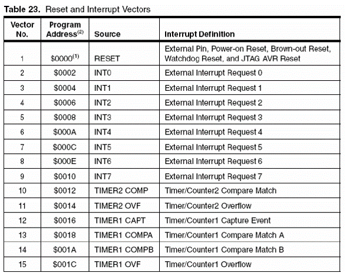
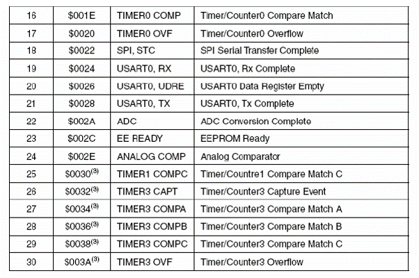

# 폴링(Polling) 방식

앞선 포스트에서 마이크로컨트롤러를 프로그래밍할 때, main함수에 무한루프를 넣어 이벤트가 발생하는지를 계속해서 소프트웨어적으로 감시하고, 특정 이벤트가 발생하면 동작을 수행하는 방식을 많이 사용했다. 이와 같은 방식을 폴링(Polling)방식이라 한다. 그런데 다음 코드를 살펴보자

``` c
int main(void)
{
    while(1)
    {
        // read button status
        // judge button status
        // print LED1 for button status
        
        // UART character recieved
        // compare recieved character
        // print LED2 for button status
    }
    return 0;
}
```
무한루프의 첫번째 과정이 버튼의 상태를 읽어오는 것이다. 만약 UART문자를 수신하고 문자를 비교하는 과정이 아주 오래걸린다고 가정하고, 그 도중에 버튼을 눌렀다면 LED에 불이 켜지지 않을 것이다. 이를 해결하기 위한 방법이 인터럽트이다.

# 인터럽트(Interrupt) 방식


> 마이크로프로세서에서 인터럽트(interrupt, 문화어: 중단, 새치기)란 마이크로프로세서(CPU)가 프로그램을 실행하고 있을 때, 입출력 하드웨어 등의 장치나 또는 예외상황이 발생하여 처리가 필요할 경우에 마이크로프로세서에게 알려 처리할 수 있도록 하는 것을 말한다.(위키피디아)

인터럽트
- 하드웨어 인터럽트
	- RESET, INT0, INT1, 등 각 AVR에 맞는 인터럽트 벡터 테이블 참고
- 소프트웨어 인터럽트
	- 커널을 통해 발생하는 인터럽트, ATmega128등의 AVR은 운영체제가 없으므로 이건 논외

인터럽트가 발생하면 마이크로컨트롤러는 인터럽트 벡터 테이블로 이동하여 해당 인터럽트 주소에 적혀있는 **인터럽트 처리 루틴(ISR)**으로 이동한다. ISR이 종료되면 원래 하던 작업을 계속한다. 위의 코드에서 버튼을 누르는 것을 인터럽트 조건으로, LED를 키는 것을 ISR로 프로그래밍했다면 위에 서술한 문제를 피할 수 있다.

## 인터럽트 벡터 테이블




위는 ATmega128의 데이타시트에 나와있는 인터럽트 벡터 테이블이다. 마찬가지로 각 AVR 데이타시트를 확인해보면 위와 같은 테이블이 있을 것이다.

인터럽트가 발생하면 ISR에서 처리하는데, ISR이 위치하는 메모리 주소는 인터럽트 벡터라고 부르고 그것들을 모아놓은 표가 인터럽트 벡터 테이블인 것이다.

## ISR 호출 조건

1. 전역 인터럽트 활성화 비트 세트
2. 개별 인터럽트 활성화 비트 세트
3. 인터럽트 발생 조건 충족

전역 인터럽트 활성화 비트는 상태 레지스터(SREG)의 7번 비트인 I비트이다. sei()함수를 쓰면 세트, cli()함수를 쓰면 클리어된다(avr/interrupt.h 헤더파일 필요).
개별 인터럽트 활성화 비트는 각 인터럽트에 따라 위치가 다르다. 가령, 아날로그-디지털 변환에서 변환 완료 시 이를 알려주는 인터럽트는 ADCSRA 레지스터의 ADIE비트를 개별 인터럽트 활성화 비트로 한다.
인터럽트 발생 조건은 인터럽트 발생 시점을 제어하는 레지스터의 비트를 세트해야하고 이것도 각 인터럽트에 따라 위치가 다르다. 가령, 외부 인터럽트인 INT0는 EICRA레지스터의 0번과 1번비트를 통해 발생 시점을 조정한다. 인터럽트 발생 조건에 대한 내용은 외부 인터럽트의 경우를 들어 자세히 설명하겠다.

## 외부 인터럽트

외부 인터럽트는 인터럽트 벡터 테이블의 INTn(n = 1부터 7)에 해당하는 인터럽트이다. 범용 입출력 핀에 가해지는 전압에 의해 발생한다. 외부 인터럽트를 사용할 수 있는 핀은 한정되어 있는데, 다음과 같다.

| 외부 인터럽트 | 포트 | ATmega128 핀 번호 |
| :--: | :--: | :--: |
| INT0 | PD0 | 25 |
| INT1 | PD1 | 26 |
| INT2 | PD2 | 27 |
| INT3 | PD3 | 28 |
| INT4 | PE4 | 6 |
| INT5 | PE5 | 7 |
| INT6 | PE6 | 8 |
| INT7 | PE7 | 9 |

INT0 인터럽트에 의한 LED 점멸 예제를 살펴보자.

``` c
#define F_CPU 16000000UL
#include <avr/io.h>
#include <util/delay.h>
#include <avr/interrupt.h>

volatile int state = 0; // current LED state

ISR(INT0_vect)
{
	state = (state + 1) % 2; //change LED state 0 or 1
}

void INIT_PORT(void)
{
	DDRB = 0x01; //PORT B의 0번 비트를 출력으로 설정
	PORTB = 0x00; //PORT B의 모든 LED 끔
	
	DDRD = 0x00; //PORT D의 모든 비트를 입력으로 설정
	PORTD = 0x01; //PORT D의 0번 핀 풀업 저항 사용 설정
}

void INIT_INT0(void)
{
	EIMSK |= (1 << INT0); //INT0 개별 인터럽트 활성화
	EICRA |= (1 << ISC01); //하강에지에서 인터럽트 발생
	sei(); //전역 인터럽트 활성
}

int main(void)
{
	INIT_PORT(); //포트 셋업
	INIT_INT0(); //INT0 인터럽트 설정 셋업
	
	while(1) {
		if(state== 1)
			PORTB = 0x01; //LED 킴
		else
			PORTB = 0x00; //LED 끔
	}
	
	return 0;
}
```
ISR이 호출되려면 세가지 조건이 필요하고 앞서 설명했다.
첫 번째, INIT_INT0에서 `sei();`로 전역 인터럽트를 활성화했다.
두 번째, INIT_INT0에서 `EICRA |= (1 << ISC01);`로 개별 인터럽트를 활성화했다.
세 번째, INIT_INT0에서 `EICRA |= (1 << ISC01);`로 인터럽트 발생 시점을 하강에지라고 명시하였고 풀업저항이 사용된 버튼을 누를 때 1에서 0으로 하강에지가  발생할 때, INT0 인터럽트가 발생하한다. 이후 ISR함수에서 state를 바꾸면 LED가 켜지거나 꺼진다.